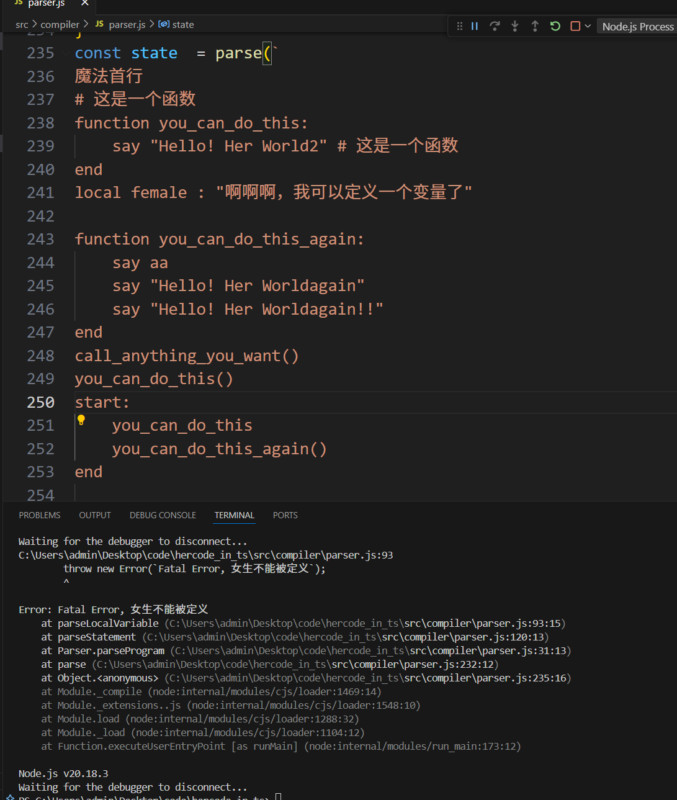
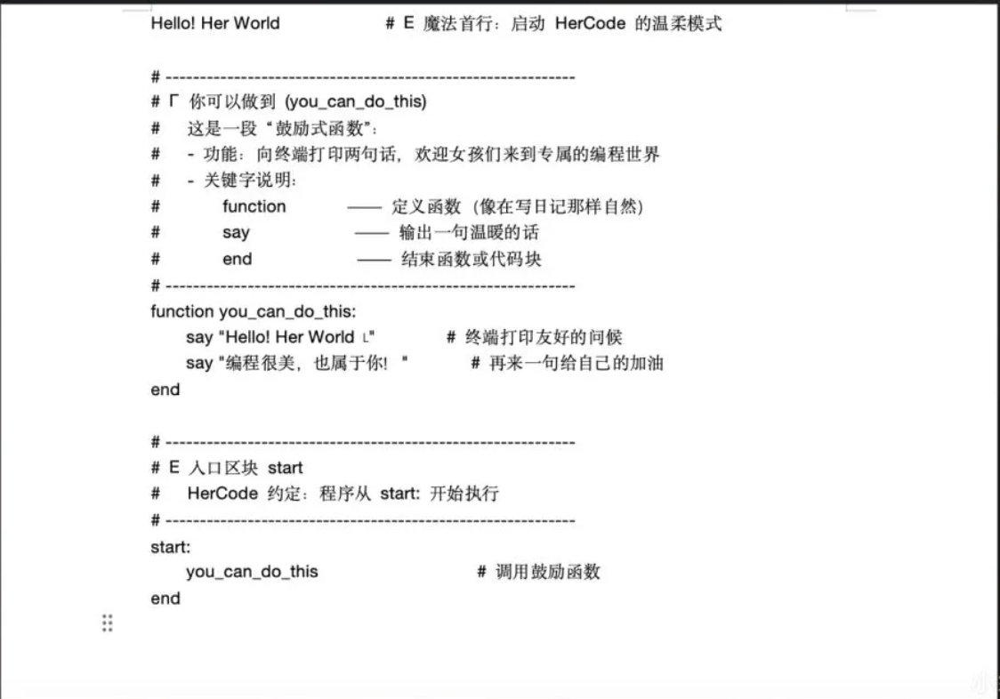

# hercode_in_ts

## 介绍
- 全女性编程语言:hercode 实现(implement in ts)
- 不好的bug和issue自己会删

## 运行截图



## 安装教程

1.  cnpm install 
2.  npm run start


## 实现feature
- 详见 [./src/test](./test) 目录
- 定义变量, 女生单词均不能被定义，否则抛出错误
- 后期会添加违规变量使用过多的情况下自动挂小红书

```js
// 正常
local aaa : "啊啊啊，我可以定义一个变量了"
// Fatal Error
local female : "啊啊啊，我可以定义一个变量了"
```

## 实现方式
- 将 ```hercode``` 转为js执行

