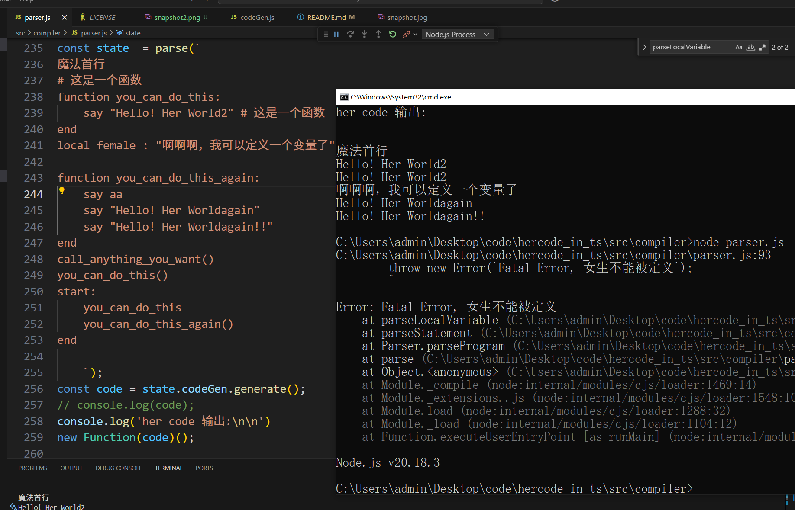
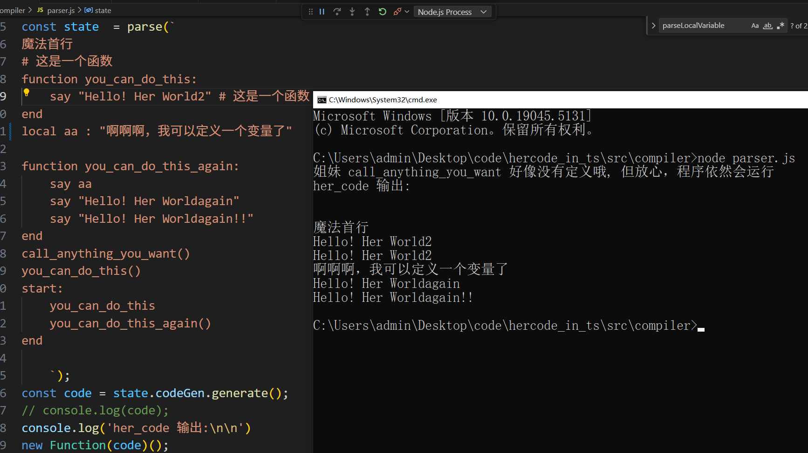

# hercode lang 运行时实现

## 介绍
- 全女性编程语言:hercode lang 运行时实现(implement in js)
- 不好的bug和issue自己会删
- 未定义的函数调用也不会影响程序正常运行哦
- 后期会添加违规变量使用过多的情况下自动挂小红书的功能


## 项目地址
- github
[https://github.com/liquancss/hercode](https://github.com/liquancss/hercode)

- gitee
[https://gitee.com/re_is_good/hercode_in_ts](https://gitee.com/re_is_good/hercode_in_ts)

## 安装教程

```bash

$ cnpm install 
$ npm run start
```

## 语法
```bash
魔法首行   # 第一行就算不是合法的hercode代码, 为了女性友好, 也会打印出来

# 这是一个函数
function you_can_do_this: 
    say "Hello! Her World2" # 这是一个函数
end

# 定义一个变量,  编译器变量名检测, 不能使用女性单词作为变量名
# 以下为错误用法, 后期将实现违规变量名使用频次高的自动挂小红书
local female : "啊啊啊，我可以定义一个变量了" #

# 她力量 就算没有定义此函数, 代码照样可以正常运行。
call_anything_you_want()

# 全局调用
you_can_do_this()

# main 入口 
start:
    you_can_do_this # 不加括号函数调用
    you_can_do_this_again() # 加括号函数调用
end

```


## 运行截图1



## 运行截图2



## 实现feature
- 详见 [./src/test](./test) 目录
- 定义变量, 女生单词均不能被定义，否则抛出错误

```js
// 正常
local aaa : "啊啊啊，我可以定义一个变量了"
// Fatal Error
local female : "啊啊啊，我可以定义一个变量了"
```

## 实现方式
- 将 ```hercode``` 转为js执行

